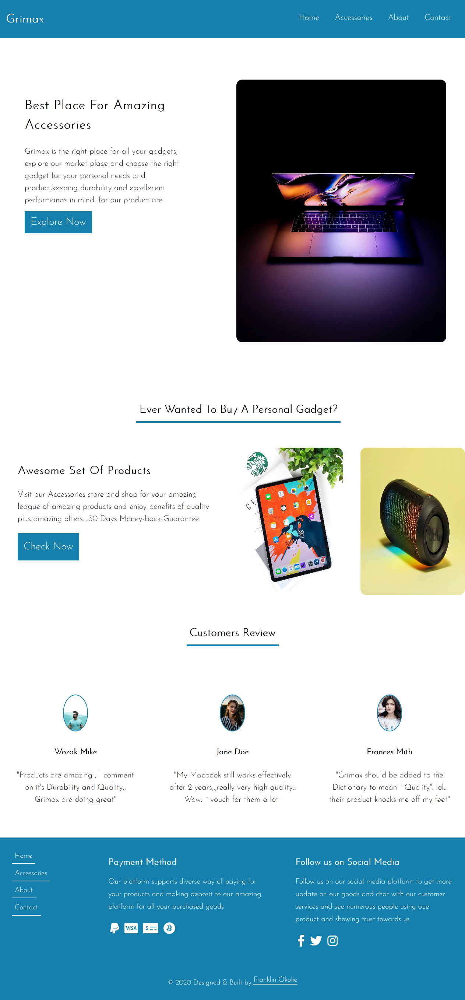

# La Hotel
 
 

Grimax is a simple, clean and minor template built for an  Digital Accessories Site.

Built using HTML, CSS and Javascript for the Mobile Navigation hamburger menu and 
Form validation.

All the images were gotten from Unsplash.

The project contains four pages which are:

1. Homepage- Welcomes Sites visitors with sweet messages.

2. Accessories- This conains all the available products which are digital accessories in stock, pictures, price and brief convincing words for customers to make choice and add
products to cart.

3. About - This page contains some imfo about the hotel, features and services they offer and some of their mentions by famous brands.

4. Contact - This page contains contact details of Grimax accessories which are physical address, email address, phone numbers and form to send a message.

Fonts Used

1. Josefin Sans
* Fall back fonts is : sans serif
 

Live Url = https://grimax.vercel.app/
